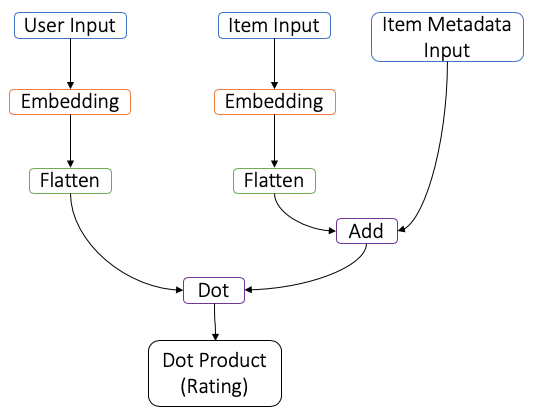
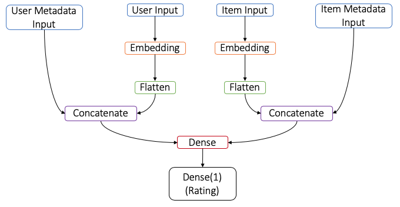

# Hybrid Recommendation Engine

This repo contains notebooks to train a hybrid recommender that incorporates user and item features, including image and text features.

## Overview

### Collaborative Filtering

Recommender systems are commonly based on a method called collaborative filtering, which leverages a user-item-rating matrix as shown below:

| | Item 1 | Item 2 | Item 3 |
| --- |:---:|:---:|:---:|
| User 1 | 3 | 0 | 5 |
| User 2 | 0 | 4 | 2 |
| User 3 | 3 | 5 | 4 |

This matrix contains ratings for user/item pairs, where 0 denotes no rating. Collaborative filtering works by finding similar users based on their ratings of items, allowing us to predict how users may rate unseen items.  For example, in the table above, since User 1 and User 3 have similar ratings of Item 1 and Item 3, we can infer that they have similar tastes.  User 1 has not rated Item 2, but User 3 has rated it high, so based on their similarity, it is likely that User 1 would also rate Item 2 high.  Thus, we can recommend Item 2 to User 1.

### Content-based Recommendations

Another common approach is a content-based recommendation system that uses information about the items, as opposed to user interactions and ratings.  For example, with a movie recommendation engine, features about the user such as genre, director, cast, description, year, etc. can be used.  If a user likes Movie A, and Movie B is similar to Movie A based on the movie features, then we can recommend Movie B to the user.

### Hybrid Approach

In a scenario where we have information on both the users and the items, as well as a ratings matrix, we can leverage a hybrid approach to incorporate all of the available information.  

## Leveraging Neural Networks

Starting with the basics, given only a user-item-rating matrix as described under [collaborative filtering](#Collaborative-Filtering), a technique called matrix factorization is used to predict ratings on unseen items.

### Matrix Factorization
1. Given a utility matrix _R_ with _n_ rows and _m_ columns (i.e. _n_ users and _m_ items)
2. Find _U_ with _n_ rows x _d_ columns, _V_ with _d_ rows x m columns, so that: _U_ · _V_ ≈ _R_
3. Measure the approximation with root-mean-square-error (RMSE) computed where R​ ≠ 0
4. Minimize RMSE using stochastic gradient descent

The neural network training algorithm provides a way to minimize RMSE using gradient descent, and the computation framework (Tensorflow + Keras) has a layer that represents the matrix dot product, so we can build a structure to perform factorization as shown below:

Matrix factorization assumes that you have a large number of users that have provided a large number of ratings spread across the item dataset. There will always be users that rate nothing and items with no ratings, but those should be a small subset of the data for factorization to work well. 

Furthermore, factorization does not incorporate any contextual information about the users or the items.

- If an item has never been rated by anyone, its similarity to other items based on metadata can be used to approximate a rating.
- If a new user comes onboard that has never rated anything before, his/her similarity to other users may be useful to provide a recommendation.

### Hybrid Recommendation Network
To leverage contextual information about the users and items and solve the cold start problem, we can augment the matrix factorization approach by incorporating all available metadata, whether it's structured data, image data, or text data (or some combination of all three).  In a case where user or item metadata includes images and/or text, we can create image and text embeddings as input into the network. 

Let's consider a case where items have an associated image.  We use a common network pre-trained on ImageNet to generate image embeddings, such as VGG16 or ResNet50.  We then train an autoencoder to reduce the dimensionality of the generated image embeddings to match the dimensions of the item embedding layer.  An example network architecture in this case is depicted below:

We can similarly apply this concept to text descriptions by creating text embeddings.  In this repo, we provide a solution that incorporates image, text, and structured metadata for items, as well as text and structured metadata for users.

There are many ways to construct this architecture to incorporate metadata and produce ratings.  While the network architecture above adds the item metadata to the item embedding, concatenating would also work, and experimentation should be done to develop an optimal architecture for your scenario.  Similarly, the architecture shows a dot product to generate the final rating prediction, whereas a Dense layer with one neuron could also be used.  For example, one final architecture we developed in this repo is illustrated below:

## Implementation
The notebooks provided in this repo are as follows:

1) Use VGG16 to create image embeddings for item images: [Generate image embeddings](./notebooks/1_generate_image_embeddings.ipynb)
2) Train an autoencoder and apply it to VGG16 embeddings for dimensionality reduction: [Autoencoder](./notebooks/2_autoencoder.ipynb)
3) Train recommendation model: [Hybrid Recommender](./notebooks/3_hybrid_recommender.ipynb)

## Contributors
Special thanks to Giovanni Marchetti and Kate Baroni for their tremendous contributions to designing the approach.